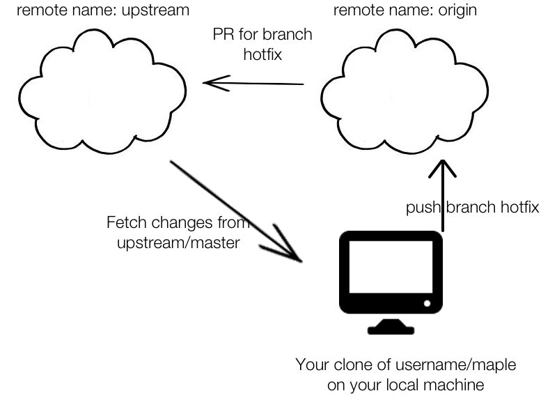

Contributing via Pull Request (PR)
----------------------------------
Credit: benrudolph (Ben Rudolph)

The first thing you'll want to do is fork the `neighbor-cook/neighbor-cook` repo so that you have your own version of the repo. Here are [instructions](https://help.github.com/articles/fork-a-repo)

Once you have forked a repo, you'll always create new branches on your origin repo, push that repo and then send a PR to neighbor-cook/neighbor-cook.

Here is an example workflow:

`git checkout -b hotfix`

This will create a new local branch from whatever branch you are on (usually master). You can check what branch you are on using `git branch`

Make some commits and fixes on branch hotfix. Then when you can push to `origin` which is your remote fork. In my case it would `rpandey1234/neighbor-cook`. Here's how to do it:

`git push origin hotfix`

This command pushes branch `hotfix` to remote repo `origin`.

Once you've pushed your branch up, log on to github and there will be a button to send a PR to neighbor-cook/neighbor-cook. You can continue pushing commits to `hotfix` with `git push origin hotfix` and the PR will
be updated. Once the PR is merged with neighbor-cook/neighbor-cook, you'll no longer be able to do so, so you'll need to work on a new branch.

How to update a branch with the newest code from `upstream/master`
---

Usually you'll want to update your local master branch or the branch you're working on with `upstream/master`
every so often so as to get the recent changes. To do so execute these commands:

    git fetch --all
    git merge upstream/master

The first command gets all the branches on `upstream` and `origin`. The second command merges `upstream/master
with your local branch.

Here's a graphic detailing what this all looks like:

